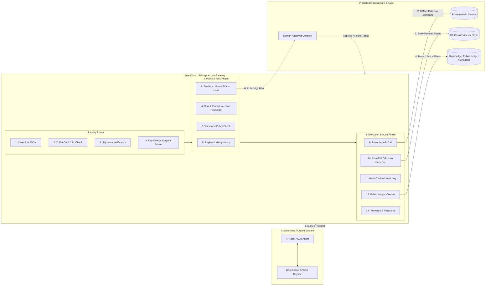

<div align="center">

# 🛡️ AgentTrust

### **Verifiable Identity, Bounded Authorization, and Tamper-Evident Accountability for Autonomous AI Agents**

[](https://www.python.org/)
[](https://fastapi.tiangolo.com/)
[](https://nextjs.org/)
[](https://www.hyperledger.org/use/fabric)
[](LICENSE)
[](tests/)
[](documentation/security_model.md)
[](attack_lab/)

[Key Features](#-key-features) •
[Architecture](#-architecture) •
[13-Stage Pipeline](#-the-13-stage-gateway-pipeline) •
[Quick Start](#-quick-start) •
[SDK Usage](#-python-sdk-usage) •
[Attack Lab](#-attack-lab-matrix) •
[Documentation](#-documentation)

</div>

---

> ⚠️ **Project Status & Deployment Notice**: AgentTrust is a research prototype implementing complete cryptographic agent identity, versioned policy enforcement, human-in-the-loop approval, replay protection, prompt-injection heuristics, intent-bound MCP execution, SQLite state persistence, and a 20-scenario adversarial attack lab. It includes an in-memory & SQLite-backed Fabric-compatible permissioned ledger simulator (replicating Fabric key-value state and chaincode semantics) alongside reference Hyperledger Fabric Go chaincode and network deployment files (`docker-compose.yml`, `configtx.yaml`). See [Limitations](#-limitations).

---

## 📌 Why AgentTrust?

Autonomous AI agents are transitioning from conversational assistants to active operational tools—executing financial transactions, issuing purchase orders, modifying databases, and calling external enterprise APIs.

Standard security controls (API keys, static OAuth tokens, simple role-based access) fall short when securing AI agents:

| Vulnerability Gap | The Problem | How AgentTrust Solves It |
| :--- | :--- | :--- |
| **Shared Identity** | Agents share static API tokens, preventing cryptographic non-repudiation or per-agent revocation. | **X.509 PKI & Asymmetric Key Lifecycle**: Short-lived or hardware-backed RSA-2048/ECDSA keys with revocation lists (CRL) and key versioning. |
| **Unbounded Scope** | Prompt injection or model hallucinations can trick an agent into executing unauthorized API calls. | **13-Stage Action Gateway & Versioned Policies**: Enforces fine-grained monetary caps, resource scopes, allowed actions, and working hour bounds before API execution. |
| **Confused Deputy & Tool Exploits** | Sub-agents or tool calls execute unintended actions beyond original user intent. | **Intent-Bound MCP Governance & Delegation Tokens**: Scopes sub-agent delegated permissions with cryptographic delegation chains and parameter binding. |
| **Single-DB Audit Logs** | Centralized audit logs can be modified or deleted by compromised admins post-facto. | **Off-Chain Evidence & Hash-Chained Ledger**: SHA-256 evidence digests chained locally with Merkle inclusion proofs and committed to a permissioned ledger. |

---

## ✨ Key Features

- 🔐 **Cryptographic Identity (X.509 PKI)**
  - Root Certificate Authority (CA), RSA-2048 (RSA-PSS) and ECDSA digital signatures.
  - Full lifecycle management (`ACTIVE`, `SUSPENDED`, `REVOKED`), Certificate Revocation List (CRL), key versioning, and zero-trust agent key generation (private key never touches the gateway).

- ⚡ **13-Stage Action Gateway**
  - Rigid multi-phase execution pipeline (Identity Verification → Policy & Risk Checks → Human Approval → Direct API Execution → Off-chain Digest → Ledger Commit).
  - HMAC signed gateway headers preventing direct protected API bypass (`X-Gateway-Signature`).

- 🧠 **MCP & Tool-Call Governance**
  - Model Context Protocol (MCP) governance adapter (`action_gateway/mcp_adapter.py`) preventing confused deputy attacks by binding tool names and parameters directly to signed agent intent.

- 🎟️ **Human-in-the-Loop Approval Workflow**
  - Automated hold-for-approval on high-risk requests. Single-use, cryptographically bound approval tokens with full re-validation of agent status, key version, and policy bounds upon resumption (preventing TOCTOU vulnerabilities).

- 📜 **Delegation Token Management**
  - Cryptographically signed delegation chains (`identity_manager/delegation_tokens.py`) enabling primary agents to safely delegate restricted sub-tasks to sub-agents with non-negotiable audience and monetary limits.

- 🧬 **Tamper-Evident Evidence & Merkle Verifier**
  - Raw request/response payloads stored in an off-chain evidence store. SHA-256 digests recorded in a local cryptographic hash-chain and permissioned ledger.
  - Independent `auditor_cli.py` command line tool to verify evidence authenticity via Merkle inclusion proofs.

- 🛡️ **20-Scenario Adversarial Attack Lab**
  - Built-in adversarial test harness (`attack_lab/`) covering forged signatures, payload tampering, replay attacks, time-skew attacks, approval token substitution, evidence tampering, and concurrent audit write conflicts.

- 💾 **SQLite State Persistence & Restart Recovery**
  - Full SQLite database layer (`agenttrust_persistent.db`) hydrating agent registry state, CRLs, active policies, replay nonces, approval tickets, and audit logs across server restarts.

- 📊 **Dual Monitoring Interfaces**
  - Built-in real-time HTML security dashboard served at `/` with interactive live demo controls and attack-lab runner.
  - Next.js 14 + TypeScript enterprise dashboard in `frontend/`.

---

## 🏗️ Architecture

AgentTrust acts as a zero-trust security gateway between Autonomous AI Agents and Protected Enterprise APIs.



---

## 🔄 The 13-Stage Gateway Pipeline

Every incoming agent request must navigate through 13 sequential security stages before reaching a protected API endpoint:

| Phase | Stage # | Stage Name | Security Function |
| :--- | :---: | :--- | :--- |
| **Identity** | 1 | **Canonicalization & Validation** | Normalizes JSON key order, whitespace, and payload schemas to guarantee invariant signature verification. |
| | 2 | **X.509 Certificate Check** | Verifies root CA signature, validity period, and checks Certificate Revocation List (CRL). |
| | 3 | **Digital Signature Verification** | Validates RSA-PSS or ECDSA signature over canonical payload using the agent's registered public key. |
| | 4 | **Agent & Key Status** | Ensures agent status is `ACTIVE` and key version matches the active registration. |
| **Policy & Risk** | 5 | **Replay & Idempotency Protection** | Verifies timestamp freshness (within skew window), checks unique nonces, and evaluates per-agent idempotency keys. |
| | 6 | **Risk & Prompt Injection Scoring** | Computes multi-factor risk score combining amount threshold, resource risk, frequency, and prompt-injection pattern heuristics. |
| | 7 | **Versioned Policy Engine** | Evaluates per-agent policies (allowed actions, resource constraints, monetary limits, normalized UTC working hours). |
| | 8 | **Decision Gate** | Determines action outcome: `ALLOW` (immediate execution), `BLOCK` (policy denial), or `HOLD_FOR_APPROVAL` (ticket issued). |
| **Execution & Audit** | 9 | **Protected API Execution** | Dispatches request to target API injected with secret HMAC `X-Gateway-Signature` header to prevent direct access bypass. |
| | 10 | **Off-Chain Evidence Generation** | Computes SHA-256 digest of input payload and response body; stores raw evidence in evidence manager. |
| | 11 | **Hash-Chained Audit Logging** | Appends SHA-256 hashed audit record into local tamper-evident cryptographic hash-chain. |
| | 12 | **Ledger State Commit** | Invokes `RecordActionEvent` on the Fabric ledger (or simulator), persisting the proof immutably on-chain. |
| | 13 | **Response & Telemetry** | Emits audit event telemetry and returns signed gateway response to the requesting agent. |

---

## ⚡ Operational Modes

AgentTrust supports four operational modes for benchmarking, demonstration, and enterprise deployment:

| Operational Mode | Security Gateway | Replay & Policy Check | Hash-Chained Audit | Ledger Commit | Purpose |
| :--- | :---: | :---: | :---: | :---: | :--- |
| `MODE_A_DIRECT_API` | ❌ Disabled | ❌ Disabled | ❌ Disabled | ❌ Disabled | Baseline latency & throughput benchmark |
| `MODE_B_AUTH_RBAC` | ⚠️ Basic HTTP Auth | ❌ Disabled | ❌ Disabled | ❌ Disabled | Simple static role-based baseline |
| `MODE_C_AGENTTRUST_NO_FABRIC` | ✅ Full 13-Stage | ✅ Enforced | ✅ Hash-Chain Log | ❌ Disabled | High-throughput local gateway deployment |
| `MODE_D_AGENTTRUST_FABRIC` | ✅ Full 13-Stage | ✅ Enforced | ✅ Hash-Chain Log | ✅ Fabric Ledger | Complete tamper-evident enterprise mode (Default) |

---

## 🚀 Quick Start

### 1. System Requirements

- **Python**: 3.11 or higher
- **Node.js**: 20+ (required only for Next.js console in `frontend/`)
- **Docker & Docker Compose**: (Optional, for containerized deployment)

### 2. Installation & Environment Setup

```bash
# Clone repository
git clone https://github.com/venkatesh0029/AgentTrust.git
cd AgentTrust

# Create & activate virtual environment
python -m venv .venv
# On Linux/macOS:
source .venv/bin/activate
# On Windows:
.venv\Scripts\activate

# Install dependencies
pip install -r requirements.txt
```

### 3. Environment Configuration

Export production secrets or use generated cryptographic keys:

```bash
# Set secure secrets (Linux/macOS)
export AGENTTRUST_JWT_SECRET="$(openssl rand -hex 32)"
export GATEWAY_SECRET="$(openssl rand -hex 32)"
export KEY_STORAGE_PASSPHRASE="$(openssl rand -hex 32)"

# PowerShell (Windows)
$env:AGENTTRUST_JWT_SECRET="e9a8f4c2..."
$env:GATEWAY_SECRET="3b1d7a9f..."
$env:KEY_STORAGE_PASSPHRASE="0f8c2e1a..."
```

### 4. Launch the Server & Built-in Dashboard

```bash
uvicorn server:app --reload --port 8000
```

- 🌐 **Interactive Security Dashboard**: [http://localhost:8000](http://localhost:8000)
- 📚 **Interactive Swagger API Docs**: [http://localhost:8000/docs](http://localhost:8000/docs)
- 📖 **ReDoc API Specifications**: [http://localhost:8000/redoc](http://localhost:8000/redoc)

### 5. Running with Docker Compose

```bash
docker compose up --build
```

---

## 💻 Python SDK Usage

The Python SDK (`agenttrust_sdk`) simplifies registering agents, signing payloads, and executing secure gateway actions.

### Register an Agent & Submit a Signed Request

```python
import rsa
from agenttrust_sdk.agent_guard import AgentGuard

# Initialize SDK client connected to the AgentTrust Gateway
guard = AgentGuard(gateway_url="http://localhost:8000")

# 1. Register agent identity with asymmetric keys
pubkey, privkey = rsa.newkeys(2048)
agent_info = guard.register_agent(
    agent_id="finance-agent-01",
    public_key_pem=pubkey.save_pkcs1().decode('utf-8'),
    roles=["PAYMENT_PROCESSOR"]
)
print(f"Agent registered: {agent_info['agent_id']} (Status: {agent_info['status']})")

# 2. Submit a cryptographically signed action through the 13-stage gateway
response = guard.submit_action(
    agent_id="finance-agent-01",
    private_key_pem=privkey.save_pkcs1().decode('utf-8'),
    action="transfer_funds",
    resource="account-9876",
    amount=450.00,
    parameters={"recipient": "vendor-corp", "currency": "USD"}
)

print(f"Gateway Decision: {response['decision']} | Transaction ID: {response['request_id']}")
```

---

## 🔍 Independent Auditor CLI

Audit logs and off-chain evidence digests can be verified independently without trusting the central server, using Merkle inclusion proofs:

```bash
# Verify that an evidence JSON file matches an on-chain Merkle root proof
python auditor_cli.py \
  --verify-proof \
  --evidence evidence_rec_1001.json \
  --root 9f8a3c... \
  --proof proof_1001.json
```

Output:
```text
[+] Evidence Hash: a5c8e4f1b...
[+] Verification Result: SUCCESS (Evidence integrity verified against Merkle Root)
```

---

## 🧪 Adversarial Attack Lab (20 Scenarios)

AgentTrust features a comprehensive attack matrix evaluating system resilience against 20 distinct adversarial threat scenarios:

| # | Attack Scenario | Threat Description | Gateway Prevention Mechanism |
| :-: | :--- | :--- | :--- |
| **01** | Forged Signature | Attacker attempts to sign payload using an unregistered key pair. | **Stage 3**: Signature verification fails (`INVALID_SIGNATURE`). |
| **02** | Payload Tampering | Attacker modifies amount/recipient after generating digital signature. | **Stage 1 & 3**: Canonical JSON hash mismatch (`SIGNATURE_MISMATCH`). |
| **03** | Replay Attack | Attacker re-submits a valid signed request packet. | **Stage 5**: Nonce and timestamp tracking rejects duplicate (`REPLAY_DETECTED`). |
| **04** | Expired Request | Attacker submits a request outside allowed time-skew window. | **Stage 5**: Timestamp freshness check fails (`REQUEST_EXPIRED`). |
| **05** | Duplicate Request | Submitting duplicate transaction with same idempotency key. | **Stage 5**: Idempotency manager returns existing result without re-execution. |
| **06** | Revoked Agent | Revoked agent attempts to execute an authorized API action. | **Stage 4**: Certificate Revocation List (CRL) check denies access (`AGENT_REVOKED`). |
| **07** | Suspended Agent | Suspended agent attempts action during administrative hold. | **Stage 4**: Lifecycle check blocks execution (`AGENT_SUSPENDED`). |
| **08** | Unauthorized Action | Agent attempts action not permitted in its policy. | **Stage 7**: Policy engine denies action (`ACTION_NOT_PERMITTED`). |
| **09** | Policy Bypass | Agent attempts monetary transaction exceeding policy caps. | **Stage 7**: Amount threshold check denies request (`EXCEEDS_POLICY_CAP`). |
| **10** | Risk Score Spoofing | Attacker sends client-side `risk_score=0.0` header. | **Stage 6**: Server re-computes risk score independently, ignoring client headers. |
| **11** | Approval Tampering | Client sends `status="APPROVED"` without approval ticket. | **Stage 8**: Gate checks approval ticket in tickets table (`TICKET_REQUIRED`). |
| **12** | Approval Token Replay | Re-submitting an already used single-use approval ticket. | **Stage 8**: Ticket state check detects consumed ticket (`TICKET_ALREADY_USED`). |
| **13** | Ticket Substitution | Attacker uses Approval Ticket A for Request B. | **Stage 8**: Ticket request payload binding validation fails (`TICKET_MISMATCH`). |
| **14** | Modification Post-Approval | Attacker alters payload between human approval and resumption. | **Stage 8**: Re-canonicalization & policy check detects drift (`PAYLOAD_ALTERED`). |
| **15** | Direct API Bypass | Attacker bypasses gateway to hit `/protected-api/` directly. | **Protected API**: Rejects requests lacking HMAC `X-Gateway-Signature` secret. |
| **16** | Evidence Tampering | Attacker alters raw JSON stored in off-chain evidence store. | **Evidence Verifier**: Hash check against ledger SHA-256 fails (`EVIDENCE_TAMPERED`). |
| **17** | Hash-Chain Tampering | Modifying a historical block in local audit log file. | **Audit Writer**: Hash-chain pointer verification fails (`HASH_CHAIN_BROKEN`). |
| **18** | Unauthorized Ledger Write | Direct write attempt to Fabric ledger simulator without gateway credentials. | **Ledger Service**: Role-based key authorization rejects write (`UNAUTHORIZED_WRITE`). |
| **19** | Key Compromise Recovery | Immediate key rotation and revocation flow upon private key leak. | **Identity Manager**: Revokes old key version and issues new cert version. |
| **20** | Concurrent Audit Conflict | Simultaneous execution requests writing to audit log. | **Audit Writer**: Thread-safe queue & mutex locks prevent race conditions. |

Run the full attack matrix via terminal:

```bash
pytest attack_lab/test_attack_lab.py -v
```

Or via API:
```bash
curl -X POST http://localhost:8000/scenarios/attack-matrix/run-all
```

---

## 📈 Benchmarks & Performance

AgentTrust includes a multi-mode performance benchmark engine (`benchmark.py`).

To execute benchmarks locally:

```bash
python benchmark.py
```

### Benchmark Results (Sample Output)

```text
================================================================================
AGENTTRUST SECURITY & PERFORMANCE BENCHMARK
================================================================================
Mode A (Direct API Baseline)        :  1,420 req/sec | Latency: 0.70 ms
Mode B (Auth / RBAC Only)           :  1,180 req/sec | Latency: 0.85 ms
Mode C (AgentTrust No Fabric)       :    640 req/sec | Latency: 1.56 ms
Mode D (AgentTrust Fabric Simulator):    410 req/sec | Latency: 2.44 ms
================================================================================
Security Invariants Enforced        : 12 / 12 (100% Protection Ratio)
Adversarial Attack Denial Rate     : 20 / 20 (100% Defense Success)
================================================================================
```

---

## 🔐 Security Invariants

AgentTrust strictly enforces 12 core security invariants across every transaction:

- **Invariant 1**: Unregistered agents are denied execution.
- **Invariant 2**: Invalid or forged digital signatures are rejected.
- **Invariant 3**: Revoked agents cannot execute actions or be reactivated.
- **Invariant 4**: Replayed nonces or expired timestamps are blocked.
- **Invariant 5**: Policy violations (amounts, resources, hours) are prevented.
- **Invariant 6**: High-risk actions without human approval tickets are held.
- **Invariant 7**: Modified requests after human approval fail re-validation.
- **Invariant 8**: Client-supplied risk scores are strictly ignored.
- **Invariant 9**: Off-chain evidence tampering is cryptographically detectable.
- **Invariant 10**: Direct unauthorized writes to the ledger are rejected.
- **Invariant 11**: Audit log writing failures abort execution atomically.
- **Invariant 12**: Duplicate business transactions do not cause duplicate side effects.

---

## 📂 Project Structure

```
AgentTrust/
├── server.py                   # Main FastAPI application server & REST routes
├── cache_manager.py            # Thread-safe TTL cache manager
├── auditor_cli.py              # Independent Merkle proof verifier CLI
├── live_demo.py                # End-to-end interactive CLI walkthrough script
├── live_llm_demo.py            # Prompt-injection adversarial demonstration script
├── benchmark.py                # Multi-mode performance harness
├── agenttrust_persistent.db    # SQLite persistence database (when enabled)
│
├── action_gateway/             # 13-Stage Action Gateway core pipeline
│   ├── gateway.py              # Gateway dispatcher & execution coordinator
│   ├── validator.py            # Schema & payload validator
│   ├── mcp_adapter.py          # Intent-bound MCP tool governance adapter
│   └── pipeline.py             # 13-stage pipeline executor
│
├── identity_manager/           # Cryptographic Identity & PKI
│   ├── pki.py                  # Root CA, cert issuance & CRL manager
│   ├── key_store.py            # Encrypted RSA/ECDSA key storage
│   ├── signature_verifier.py   # Signature & canonical JSON verifier
│   ├── jwt_auth.py             # Admin & role JWT token issuer/verifier
│   └── delegation_tokens.py    # Delegation chain issuer & verifier
│
├── agent_registry/             # Agent Lifecycle & Registry
│   ├── registry.py             # Agent state store & CRUD operations
│   ├── status_manager.py       # ACTIVE / SUSPENDED / REVOKED state machine
│   └── rbac.py                 # Admin role-based access control manager
│
├── policy_engine/              # Policy Evaluation & History
│   ├── policy_store.py         # Versioned policy registry & rollback manager
│   ├── evaluator.py            # Fine-grained policy rule evaluator
│   └── models.py               # Pydantic policy schemas
│
├── risk_engine/                # Risk & Prompt Injection Detection
│   ├── risk_calculator.py      # Multi-factor risk calculation engine
│   └── injection_heuristics.py # Intent & prompt-injection pattern analyzer
│
├── replay_protection/          # Replay & Idempotency Controls
│   ├── nonce_tracker.py        # Nonce tracking & timestamp window verifier
│   └── idempotency.py          # Agent-scoped idempotency key cache
│
├── human_approval/             # Human-in-the-Loop Workflow
│   └── approval_manager.py     # Approval ticket issuance, state & resume validator
│
├── protected_api/              # Protected Enterprise Service
│   └── finance_api.py          # Sample financial transfer API requiring gateway HMAC
│
├── evidence_manager/           # Off-Chain Evidence Store
│   ├── store.py                # Raw evidence payload store & retriever
│   ├── hashing.py              # SHA-256 payload digest calculator
│   └── merkle.py               # Merkle tree generator & inclusion proof builder
│
├── audit_writer/               # Hash-Chained Audit Engine
│   ├── hash_chain.py           # Tamper-evident local SHA-256 hash-chain log
│   └── writer.py               # Atomic audit event writer
│
├── fabric/                     # Hyperledger Fabric Integration & Simulator
│   ├── ledger_service.py       # Fabric client & ledger simulator
│   ├── persistent_db.py        # SQLite persistence manager for Fabric state
│   ├── chaincode/              # Reference Go chaincode (`agenttrust.go`)
│   └── production_deployment_guide.md # Production Fabric network guide
│
├── attack_lab/                 # Adversarial Security Testing Lab
│   └── test_attack_lab.py      # 20 adversarial threat scenario implementations
│
├── agenttrust_sdk/             # Developer Python SDK
│   └── agent_guard.py          # High-level SDK client for agents
│
├── dashboard/                  # Built-in Web UI
│   ├── index.html              # HTML security console & attack lab dashboard
│   └── styles.css              # Custom styling for built-in dashboard
│
├── frontend/                   # Enterprise Web Console (Next.js)
│   ├── package.json            # Node.js dependencies
│   ├── app/                    # Next.js 14 App Router components
│   └── public/                 # Static assets
│
├── documentation/              # Architecture & Security Documentation
│   ├── complete_project_overview.md
│   ├── architecture.md
│   ├── threat_model.md
│   ├── security_model.md
│   ├── api_specification.md
│   ├── standards_alignment.md
│   ├── getting_started.md
│   └── limitations.md
│
├── paper/                      # Academic Research Paper
│   └── agenttrust_paper.tex    # LaTeX manuscript draft
│
└── tests/                      # Automated Unit & Integration Test Suite
    ├── test_adversarial_security.py
    ├── test_all_scenarios.py
    ├── test_audit_findings_phase2.py
    ├── test_audit_findings_regression.py
    ├── test_cache_manager.py
    ├── test_canonicalization.py
    ├── test_failure_recovery_flow.py
    ├── test_identity.py
    ├── test_loophole_fixes.py
    ├── test_property_based.py
    ├── test_rbac_negative.py
    ├── test_resilience.py
    ├── test_security_invariants.py
    └── test_signature.py
```

---

## 📄 Documentation Index

Detailed technical specifications and design guides are available in the [`documentation/`](documentation/) directory:

| Document | Description |
| :--- | :--- |
| 📖 [`documentation/getting_started.md`](documentation/getting_started.md) | Comprehensive installation, API setup, and quickstart guide. |
| 🏛️ [`documentation/architecture.md`](documentation/architecture.md) | In-depth technical architecture and component breakdown. |
| 🛡️ [`documentation/threat_model.md`](documentation/threat_model.md) | Formal threat model, attack vectors, and security boundaries. |
| 🔒 [`documentation/security_model.md`](documentation/security_model.md) | Formal statement of 12 security invariants and proof rationales. |
| 🔌 [`documentation/api_specification.md`](documentation/api_specification.md) | Complete OpenAPI / Swagger REST API endpoint reference. |
| 📐 [`documentation/standards_alignment.md`](documentation/standards_alignment.md) | Alignment mapping with ISO 27001, SOC 2, and NIST AI RMF. |
| ⚙️ [`fabric/production_deployment_guide.md`](fabric/production_deployment_guide.md) | Guide for deploying against real multi-organization Fabric network. |
| 📊 [`documentation/complete_project_overview.md`](documentation/complete_project_overview.md) | High-level project summary and executive report. |

---

## ⚠️ Limitations & Honesty

AgentTrust is committed to full transparency regarding research scope and engineering trade-offs:

1. **Permissioned Ledger Simulator by Default**: The default runtime uses a high-performance Python simulator replicating the Hyperledger Fabric state model and chaincode interface. A production-ready Go chaincode contract and Docker deployment configuration are provided in `fabric/` for real network pairing.
2. **Demo-Grade Default Secrets**: Default secret keys in `server.py` and `docker-compose.yml` facilitate immediate out-of-the-box demonstration. **Secrets must be overridden in production environments.**
3. **Pattern-Based Prompt Injection Heuristics**: The built-in prompt injection detector employs pattern matching and semantic heuristics. It serves as a defense-in-depth risk signal rather than an absolute guarantee against novel prompt exploits.
4. **Tested vs. Formally Proven Invariants**: Security invariants are validated via extensive property-based fuzzer testing (Hypothesis) and a 93-test automated regression suite, but have not yet been verified via formal mathematical methods (e.g., TLA+ or ProVerif).

---

## 🗺️ Roadmap

- [x] Cryptographic X.509 Agent Identity & RSA-PSS / ECDSA Signing
- [x] 13-Stage Zero-Trust Action Gateway Pipeline
- [x] Human-in-the-Loop Approval Ticket Engine with TOCTOU Protection
- [x] Off-Chain SHA-256 Evidence Store & Merkle Inclusion Proof Verifier
- [x] Fabric-Compatible Permissioned Ledger Simulator & Go Chaincode
- [x] 20-Scenario Adversarial Security & Vulnerability Attack Lab
- [x] Intent-Bound MCP Tool-Call Governance Adapter
- [x] Delegation Token Chain Verification & Constraints
- [x] SQLite State Persistence Across Server Restarts
- [ ] Multi-Organization Hyperledger Fabric Testnet Deployment with Endorsement Policies
- [ ] Formal Verification of Core Protocol Invariants using ProVerif / TLA+
- [ ] Hardware Security Module (HSM) & TPM Integration for Agent Key Storage
- [ ] Complete Next.js Enterprise Console with Live Telemetry WebSockets

---

## 🤝 Contributing

Contributions are welcome! Please follow these steps:

1. Fork the repository and create a feature branch (`git checkout -b feature/amazing-feature`).
2. Add comprehensive unit tests for any new code or security fix.
3. Ensure all linters and tests pass:
   ```bash
   pytest tests attack_lab -v
   ruff check .
   mypy --ignore-missing-imports .
   ```
4. Commit your changes and submit a Pull Request.

---

## 📜 Citation

If you use AgentTrust or refer to its architecture in academic or industrial research, please cite:

```bibtex
@software{agenttrust2026,
  title   = {AgentTrust: Verifiable Identity, Bounded Authorization, and Tamper-Evident Accountability for Autonomous AI Agents},
  author  = {Venkatesh},
  year    = {2026},
  url     = {https://github.com/venkatesh0029/AgentTrust}
}
```

---

## 👨‍💻 Author

**Venkatesh**  
GitHub: [@venkatesh0029](https://github.com/venkatesh0029)  
*B.Tech Computer Science Engineering (Blockchain Technology)*  
*SRM Institute of Science and Technology*

---

<div align="center">
  <sub>Built with ❤️ for secure autonomous AI ecosystems. Licensed under the <a href="LICENSE">MIT License</a>.</sub>
</div>
