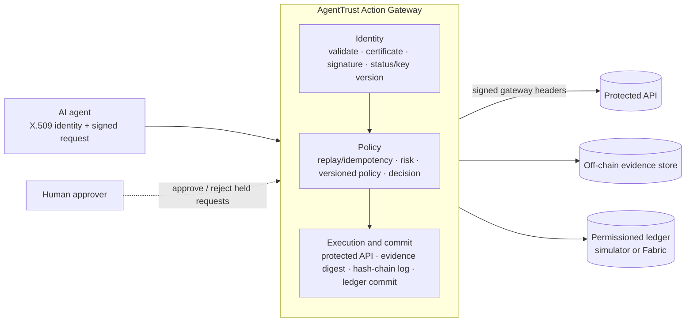

<div align="center">

# AgentTrust

**Verifiable identity, bounded authorization, and tamper-evident accountability for autonomous AI agents.**


</div>

> **Project status: research prototype.**
> AgentTrust implements the identity, policy, approval, replay-protection and audit components below and tests them with an automated suite and a 20-scenario attack lab. The ledger is a **Fabric-compatible permissioned ledger simulator** (a Python implementation of the Fabric data model and chaincode interface). A Hyperledger Fabric network definition and Go chaincode are included as a reference deployment, but the default build does **not** run against real Fabric peers or orderers. See [Limitations](#limitations).

---

## Table of contents

- [Why AgentTrust](#why-agenttrust)
- [Features](#features)
- [Architecture](#architecture)
- [Quick start](#quick-start)
- [Configuration](#configuration)
- [API overview](#api-overview)
- [Security model](#security-model)
- [Testing](#testing)
- [Benchmarks](#benchmarks)
- [Project structure](#project-structure)
- [Limitations](#limitations)
- [Roadmap](#roadmap)
- [Documentation](#documentation)
- [Contributing](#contributing)
- [License](#license)
- [Citation](#citation)

---

## Why AgentTrust

Autonomous AI agents now call real APIs: they move money, create purchase orders and change records. Typical deployments leave four gaps:

| Gap | What goes wrong |
|---|---|
| **Identity** | An agent is identified by a shared token, not a cryptographic identity that can be revoked and rotated. |
| **Authorization** | Limits live in application code and can be bypassed by a manipulated or prompt-injected agent. |
| **Execution control** | High-risk actions run without oversight, and duplicate or replayed requests are not rejected. |
| **Accountability** | Audit logs sit in one administrator-controlled database and can be edited after the fact. |

AgentTrust places a **gateway** between agents and protected APIs. Every action must pass identity, policy, replay and risk checks, and every decision is recorded in a hash-chained audit trail with off-chain evidence digests.

## Features

- **Cryptographic agent identity.** X.509 certificates issued by a Root CA, RSA-2048 (RSA-PSS) and ECDSA signing, key versioning, key rotation, a certificate revocation list, and `ACTIVE` / `SUSPENDED` / `REVOKED` lifecycle states. Agents can supply their own public key so the private key never reaches the server.
- **13-stage action gateway.** Schema and amount validation, certificate and signature verification, replay and idempotency protection, server-side risk scoring, a versioned policy engine and a decision step (allow, block, or hold for approval).
- **Human approval workflow.** Single-use approval tickets bound to the original request, with re-validation of agent status and policy before execution.
- **Versioned policies.** Per-agent allowed actions, resource scope, monetary limits, working hours, version history and rollback.
- **Tamper-evident evidence.** Raw payloads stay off-chain; a SHA-256 digest is chained locally and committed to the ledger. Any modification is reported as `TAMPERING_DETECTED`.
- **Fabric-compatible ledger.** World-state key-value store, hash-linked blocks, and chaincode functions `RegisterAgent`, `RegisterPolicy`, `RecordActionEvent` and `EvaluateTransactionPolicy`.
- **Attack lab.** 20 adversarial scenarios (forged signatures, replay, payload modification after approval, direct API bypass, evidence tampering and more) runnable from the API, tests or dashboard.
- **Dashboards.** A built-in HTML dashboard served by the API, and a Next.js console in `frontend/` (in development).
- **Tooling.** Python SDK (`agenttrust_sdk`), independent auditor CLI with Merkle inclusion proofs, benchmark harness, property-based tests with Hypothesis, and GitHub Actions CI.

## Architecture



### The 13 pipeline stages

| Phase | # | Stage |
|---|---|---|
| Identity | 1 | Canonical JSON and input validation |
| | 2 | X.509 certificate verification (CA signature, expiry, revocation) |
| | 3 | RSA-PSS / ECDSA signature verification |
| | 4 | Agent status and key-version check |
| Policy | 5 | Replay and idempotency protection |
| | 6 | Server-side risk evaluation |
| | 7 | Versioned policy evaluation |
| | 8 | Decision: allow, block, or issue a human approval ticket |
| Execution and commit | 9 | Protected API execution (signed gateway headers required) |
| | 10 | Off-chain SHA-256 evidence generation |
| | 11 | Local hash-chained audit log |
| | 12 | Ledger commit (`RecordActionEvent`) |
| | 13 | Final response and telemetry |

Signature verification runs before any business logic, so unauthenticated requests are rejected without creating evidence or ledger entries.

### State separation

Only cryptographic proof goes on the ledger (SHA-256 digest, agent ID, nonce, timestamp). Raw API payloads stay in the off-chain evidence store.

## Quick start

### Prerequisites

- Python 3.11+
- Node.js 20+ (only for the Next.js console)
- Docker (optional)

### Run the API and built-in dashboard

```bash
git clone https://github.com/venkatesh0029/AgentTrust.git
cd AgentTrust

python -m venv .venv
source .venv/bin/activate        # Windows: .venv\Scripts\activate
pip install -r requirements.txt

# Set secrets before running anything beyond a local demo (see Configuration)
export AGENTTRUST_JWT_SECRET="$(openssl rand -hex 32)"
export GATEWAY_SECRET="$(openssl rand -hex 32)"
export KEY_STORAGE_PASSPHRASE="$(openssl rand -hex 32)"

uvicorn server:app --reload --port 8000
```

Open <http://localhost:8000> for the dashboard and <http://localhost:8000/docs> for the interactive API documentation.

### Run with Docker

```bash
docker compose up --build
```

The compose file reads secrets from the environment. Replace the placeholder values in `docker-compose.yml` with your own before use.

### Run the tests

```bash
pytest tests attack_lab -v
```

### Run the demos

```bash
python live_demo.py        # end-to-end scripted walkthrough
python live_llm_demo.py    # scripted prompt-injection scenarios against the gateway
python benchmark.py        # performance harness
```

### Next.js console (in development)

```bash
cd frontend
npm install
npm run dev                # http://localhost:3000
```

The console expects the API at `http://127.0.0.1:8000`. It is under active development; the built-in dashboard served at `/` is the reference UI today.

### Auditor CLI

Independently verify that an evidence record is included in a Merkle root:

```bash
python auditor_cli.py --verify-proof --evidence evidence.json --root <merkle_root> --proof proof.json
```

## Configuration

| Variable | Purpose | Default |
|---|---|---|
| `AGENTTRUST_JWT_SECRET` | Signing secret for admin JWTs | Development default (**must override**) |
| `GATEWAY_SECRET` | HMAC secret for gateway-to-API signed headers | Development default (**must override**) |
| `KEY_STORAGE_PASSPHRASE` | Passphrase used to encrypt private keys at rest | Development default (**must override**) |
| `AGENTTRUST_DEMO_MODE` | Enables sandbox tamper-test endpoints | `true` (set `false` outside demos) |
| `AGENTTRUST_ALLOW_MODE_CHANGE` | Allows switching operational mode at runtime | `true` (set `false` outside demos) |
| `AGENTTRUST_MODE` | Operational mode (see below) | `MODE_D_AGENTTRUST_FABRIC` |
| `FABRIC_PEER_ENDPOINT` | Peer address for the reference Fabric deployment | unset |

The defaults exist so the project runs out of the box for demonstrations. **Do not expose an instance with default secrets.**

### Operational modes (used by the benchmark and attack lab)

| Mode | Description |
|---|---|
| `MODE_A_DIRECT_API` | Baseline: direct calls to the protected API with no AgentTrust controls |
| `MODE_B_AUTH_RBAC` | Authentication and role checks only |
| `MODE_C_AGENTTRUST_NO_FABRIC` | Full gateway pipeline with a local audit log |
| `MODE_D_AGENTTRUST_FABRIC` | Full gateway pipeline plus ledger commits (simulator by default) |

## API overview

Interactive docs are available at `/docs`. Main route groups:

| Area | Endpoints |
|---|---|
| Health and mode | `GET /api/health`, `GET/POST /mode` |
| Agents | `POST /agents/register`, `GET /agents`, `GET /agents/{id}`, `POST /agents/{id}/suspend`, `/revoke`, `/reactivate`, `/rotate-key` |
| Policies | `POST /policies`, `GET /policies`, `GET /policies/{id}`, `POST /policies/rollback` |
| Actions | `POST /actions/submit`, `POST /gateway/submit`, `GET /actions/{request_id}` |
| Approvals | `GET /approvals/pending`, `POST /approvals/{id}/approve`, `POST /approvals/{id}/reject` |
| Evidence | `GET /evidence/{id}`, `POST /evidence/{id}/verify` |
| Audit | `GET /audit/chain`, `GET /audit/chain/verify`, `GET /audit/events`, `GET /audit/blockchain/blocks` |
| Ledger | `GET /fabric/status`, `POST /fabric/record-evidence`, `GET /fabric/evidence/{request_id}`, `POST /fabric/verify-evidence` |
| Attack lab | `GET /scenarios/attack-matrix`, `POST /scenarios/attack-matrix/run-all`, `POST /scenarios/attack-matrix/run/{id}` |
| Benchmarks | `GET/POST /benchmark/run` |

Administrative routes require a role (`SYSTEM_ADMIN`, `FINANCE_APPROVER`, `POLICY_ADMIN`, `AUDITOR`) with separated permissions. See [`documentation/api_specification.md`](documentation/api_specification.md).

### Submitting a signed action (Python SDK)

```python
from agenttrust_sdk.agent_guard import AgentGuard

# Construct the guard with your agent ID, private key and gateway URL
# (see documentation/getting_started.md for the exact constructor arguments).
```

## Security model

### Invariants enforced and tested

1. **Authorization boundary.** Actions outside an agent's policy are blocked.
2. **Identity lifecycle.** Revoked or suspended agents cannot act, and revoked agents cannot be reactivated.
3. **Auditability.** Every decision, including blocks, produces an audit record.
4. **Evidence integrity.** Off-chain evidence is verifiable against its on-chain SHA-256 digest.
5. **Replay and idempotency.** Duplicate request IDs, nonces and stale timestamps are rejected.
6. **Administrative separation.** Approval, policy changes and agent lifecycle actions require distinct roles, and policy history is versioned.

These are verified by tests and the attack lab. They are **not** formally proven.

### Attack lab scenarios

| # | Scenario | # | Scenario |
|---|---|---|---|
| 1 | Forged signature | 11 | Client-side approval status manipulation |
| 2 | Modified signed payload | 12 | Approval token replay |
| 3 | Replay attack | 13 | Approval token substitution |
| 4 | Expired request | 14 | Request modification after approval |
| 5 | Duplicate business request (idempotency) | 15 | Direct protected-API access |
| 6 | Revoked agent | 16 | Tampered off-chain evidence |
| 7 | Suspended agent | 17 | Tampered hash-chain record |
| 8 | Unauthorized action | 18 | Unauthorized ledger write |
| 9 | Policy bypass attempt | 19 | Key compromise recovery |
| 10 | Client-side risk score manipulation | 20 | Concurrent audit-write conflict |

### Trust assumptions

- The gateway process and its Root CA key are trusted. A compromised gateway can lie to the ledger unless limits are also enforced in chaincode on a real multi-organization network.
- The threat model and standards mapping are in [`documentation/threat_model.md`](documentation/threat_model.md) and [`documentation/standards_alignment.md`](documentation/standards_alignment.md).

### Reporting vulnerabilities

Please report security issues privately through GitHub's *Security → Report a vulnerability* feature rather than a public issue.

## Testing

```bash
pytest tests attack_lab -v                         # full suite
pytest --cov=. --cov-report=term-missing           # with coverage
ruff check .                                       # lint
mypy --ignore-missing-imports identity_manager action_gateway policy_engine fabric
```

The suite covers signature and canonicalization behavior, identity and RBAC, the security invariants, resilience and failure recovery, property-based fuzzing of inputs, regression tests for every audit finding, and the 20 attack-lab scenarios. CI runs these on every push.

## Benchmarks

```bash
python benchmark.py
```

The harness compares the four operational modes and a concurrency sweep. Results depend on hardware, Python version and load-generator placement, so **run it on your own machine and record the environment alongside the numbers.** The in-process ledger commit is a Python call, not a network round-trip; a real Fabric network adds endorsement and ordering latency.

## Project structure

```
AgentTrust/
├── server.py               FastAPI application and routes
├── action_gateway/         13-stage gateway, request validation, MCP governance adapter
├── identity_manager/       Certificates, keys, signatures, JWT, delegation tokens
├── agent_registry/         Agent store, registration, status machine, admin RBAC
├── policy_engine/          Policy models, loader (versioned), evaluator
├── risk_engine/            Server-side risk evaluation, injection heuristics
├── replay_protection/      Nonce, timestamp and request tracking
├── human_approval/         Approval tickets and manager
├── protected_api/          Sample finance API behind the gateway
├── evidence_manager/       Evidence store, hashing, Merkle tree
├── audit_writer/           Local hash-chained audit log, ledger writer
├── fabric/                 Ledger simulator, client, Go chaincode, Fabric network config
├── agenttrust_sdk/         Python SDK for agents
├── attack_lab/             20 adversarial scenarios
├── tests/                  Unit, integration, property-based and regression tests
├── benchmarks/             Benchmark engine and comparison scripts
├── dashboard/              Built-in HTML dashboard
├── frontend/               Next.js + TypeScript console (in development)
├── documentation/          Architecture, threat model, API spec, reports
├── paper/                  Manuscript draft
└── auditor_cli.py          Independent evidence verifier
```

## Limitations

This project is honest about what it is.

- **The ledger is a simulator by default.** The Python ledger reproduces the Fabric data model and chaincode interface. The Docker Compose Fabric definition, `configtx.yaml` and Go chaincode are a reference deployment, and the gateway does not yet submit real Fabric transactions (endorsement, ordering and MSP identity checks are not exercised).
- **State is in memory by default.** The agent registry, replay tracker, approvals, evidence index, CRL and Root CA do not survive a restart unless you wire in the SQLite persistence module (`fabric/persistent_db.py`).
- **Demo-grade defaults.** Secrets, demo mode and runtime mode switching ship with development defaults. Override them for any shared deployment.
- **Authentication is early.** Admin JWT support exists, but the project is not a hardened identity provider; run it behind your own authentication and network controls.
- **Experimental modules.** The MCP governance adapter, delegation-token manager, prompt-injection heuristics and Merkle auditor are standalone components and are not enforced in the default gateway pipeline. The injection heuristics are pattern-based and should be treated as a weak signal, not a defense.
- **Invariants are tested, not formally verified.**
- **Money is handled as floating-point in places;** production use would require a decimal type end to end.

## Roadmap

- [ ] Run against a real two-organization Hyperledger Fabric network with endorsement policies and chaincode-enforced limits
- [ ] Persist all state (registry, replay, approvals, CA, CRL, ledger) and add restart tests
- [ ] Production authentication (short-lived asymmetric JWTs or mTLS) and removal of development defaults
- [ ] Bind tool name and arguments to the signed authorization (MCP / A2A adapter)
- [ ] Enforce delegation tokens in the gateway with full chain verification and revocation
- [ ] Measured evaluation against real baselines (OPA, OAuth2 + mTLS) and public agent-security benchmarks
- [ ] Formal model of the protocol (TLA+ or ProVerif)
- [ ] Complete the Next.js console and add live telemetry streaming

## Documentation

| Document | Contents |
|---|---|
| [`documentation/getting_started.md`](documentation/getting_started.md) | Setup and walkthrough |
| [`documentation/architecture.md`](documentation/architecture.md) | System design |
| [`documentation/threat_model.md`](documentation/threat_model.md) | Assets, attackers, trust boundaries |
| [`documentation/security_model.md`](documentation/security_model.md) | Security properties |
| [`documentation/api_specification.md`](documentation/api_specification.md) | API reference |
| [`documentation/limitations.md`](documentation/limitations.md) | Known limitations |
| [`documentation/standards_alignment.md`](documentation/standards_alignment.md) | Standards mapping |
| [`fabric/production_deployment_guide.md`](fabric/production_deployment_guide.md) | Reference Fabric deployment |

## Contributing

Issues and pull requests are welcome.

1. Fork the repository and create a feature branch.
2. Add or update tests; every security fix should include a regression test.
3. Run `pytest`, `ruff check .` and `mypy` locally.
4. Open a pull request describing the change and its security impact.

## License

Released under the MIT License. See [`LICENSE`](LICENSE).

## Citation

If you use AgentTrust in academic work, please cite:

```bibtex
@software{agenttrust2026,
  title   = {AgentTrust: Verifiable Identity, Bounded Authorization and Accountability for Autonomous AI Agents},
  author  = {Venkatesh},
  year    = {2026},
  url     = {https://github.com/venkatesh0029/AgentTrust}
}
```

## Author

<<<<<<< HEAD
**Venkatesh** ([@venkatesh0029](https://github.com/venkatesh0029)), B.Tech CSE (Blockchain Technology), SRM Institute of Science and Technology.
=======
**Venkatesh** ([@venkatesh0029](https://github.com/venkatesh0029)), B.Tech CSE (Blockchain Technology), SRM Institute of Science and Technology.
>>>>>>> 69e6a14 (fix(security): resolve 11 critical loopholes, implement intent-bound MCP execution, JWT auth endpoints, delegation verification, SQLite restart persistence, and 86-test regression suite)
