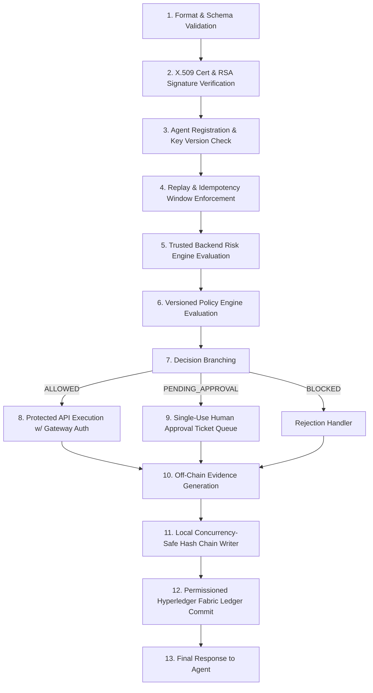

# AgentTrust Architecture & Design Specification

## Executive Overview
**AgentTrust** is a permissioned blockchain framework designed to provide verifiable identity, risk-aware bounded authorization, replay/idempotency protection, controlled execution, human supervisor approval, and independently verifiable auditability for autonomous AI agents.

The core design centers on an **AI Procurement Agent** case study executing high-risk financial procurement operations (creating purchase orders, executing fund transfers, requesting reimbursements, and inspecting accounts).

---

## The 13-Stage Action Gateway Security Pipeline
Every incoming agent request is processed through a strict, non-bypassable 13-stage pipeline before any target API logic executes:

### Stage Details

1. **Format & Schema Validation**: Verifies field types, non-empty canonical keys (`request_id`, `agent_id`, `action`, `resource`, `amount`, `nonce`, `timestamp`, `signature`).
2. **X.509 Certificate Verification**: Validates certificate validity dates (`not_valid_before`, `not_valid_after`) against Root CA trust chain.
3. **Cryptographic RSA/Ed25519 Signature Verification**: SHA-256 with PKCS#1 v1.5 verification over JCS (RFC 8785) canonical JSON payload.
4. **Agent Lifecycle & Key Version Check**: Checks agent status (`ACTIVE`, `SUSPENDED`, `REVOKED`) and checks request `key_version` against registry key version counter.
5. **Replay & Idempotency Protection**: Nonce tracking, 5-minute (300s) timestamp freshness window, and idempotency key caching.
6. **Trusted Risk Engine Evaluation**: Calculates dynamic risk score (0–100) and risk level (`LOW`, `MEDIUM`, `HIGH`) strictly on the server. Client-supplied risk overrides are rejected.
7. **Versioned Policy Engine Evaluation**: Evaluates fine-grained constraints (maximum transaction amounts, action allowlists, working hours, human approval thresholds).
8. **Decision Branching**: Directs flow to immediate execution, human approval queue holding, or block/rejection.
9. **Protected API Execution**: Executes business logic only when called with signed `gateway_token` and auth headers; direct external calls return `403 DIRECT_ACCESS_DENIED`.
10. **Off-Chain Evidence Generation**: Calculates SHA-256 digests of input payload, policy snapshot, risk score, decision, and execution outputs.
11. **Concurrency-Safe Audit Hash Chain**: Atomically appends structured event to local sequence log linking `previous_record_hash` to current `record_hash`.
12. **Hyperledger Fabric Chaincode Commit**: Submits transaction to permissioned ledger enforcing caller MSP authorization (`Org1MSP` / `Org2MSP`).
13. **Final Response Generation**: Returns standardized execution status, decision reason, risk summary, and evidence reference to the agent.

---

## Operational Modes
To evaluate security vs latency trade-offs, AgentTrust supports 4 runtime modes (`AGENTTRUST_MODE`):

| Mode | Name | Gateway Checks | Risk Engine | Hash Chain | Fabric Commit |
|---|---|---|---|---|---|
| **Mode A** | Direct API | None (Bypass) | Disabled | Disabled | Disabled |
| **Mode B** | Auth + RBAC | Cert & Sig Only | Disabled | Disabled | Disabled |
| **Mode C** | AgentTrust (No Fabric) | Full 13-Stage | Enabled | Enabled | Disabled |
| **Mode D** | Full AgentTrust (Fabric) | Full 13-Stage | Enabled | Enabled | Enabled |

---

## Cryptographic Specification
- **Root CA**: X.509 v3 self-signed CA (RSA 2048-bit, SHA-256).
- **Agent Keys**: RSA 2048-bit or Ed25519 keypairs stored encrypted at rest with AES-256-GCM PEM headers.
- **Canonicalization**: RFC 8785 JSON Canonicalization Scheme (JCS) sorting top-level and nested dictionary keys lexicographically.
- **Digest Algorithm**: SHA-256 for request hashes, evidence hashes, and block Merkle trees.
