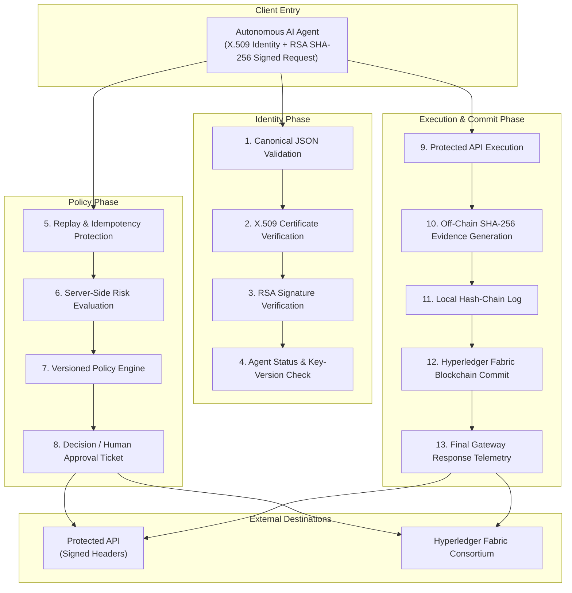

# AgentTrust Architecture & Security Documentation

AgentTrust is a security and accountability framework designed to control and monitor autonomous AI agents interacting with enterprise resources, financial APIs, and business systems.

## Blockchain Architecture Distinction

> **Technical Credibility Notice**:
> AgentTrust includes a native **Fabric-compatible permissioned ledger engine** and **Chaincode smart contract abstraction** in Python (`RegisterAgent`, `RegisterPolicy`, `RecordActionEvent`, `VerifyEvidenceReference`) featuring state database (World State), append-only hash-linked blockchain ledger immutability, and MSP identity checking. Full deployment on a multi-peer Hyperledger Fabric network via Fabric SDK is supported as an external integration target.

# AgentTrust Architecture & Security Documentation

AgentTrust is a security and accountability framework designed to control and monitor autonomous AI agents interacting with enterprise resources, financial APIs, and business systems.

## Blockchain Architecture Distinction

> **Technical Credibility Notice**:
> AgentTrust includes a native **Fabric-compatible permissioned ledger engine** and **Chaincode smart contract abstraction** in Python (`RegisterAgent`, `RegisterPolicy`, `RecordActionEvent`, `VerifyEvidenceReference`) featuring state database (World State), append-only hash-linked blockchain ledger immutability, and MSP identity checking. Full deployment on a multi-peer Hyperledger Fabric network via Fabric SDK is supported as an external integration target.

---

## Proposed Private Blockchain Architecture Diagram

The system follows a strict 3-phase, 13-step pipeline processing signed AI agent requests from ingestion to blockchain commit and response telemetry.

### Mermaid Diagram Representation



---

### ASCII System Box Layout

```
=============================================================================================================================
                                      PROPOSED PRIVATE BLOCKCHAIN ARCHITECTURE
=============================================================================================================================

                                       ┌───────────────────────────────────┐
                                       │       Autonomous AI Agent         │
                                       │   (X.509 Identity + RSA SHA-256   │
                                       │          Signed Request)          │
                                       └─────────────────┬─────────────────┘
                                                         │
                        ┌────────────────────────────────┼────────────────────────────────┐
                        │                                │                                │
                        ▼                                ▼                                ▼
  ┌─────────────────────────────────┐  ┌─────────────────────────────────┐  ┌─────────────────────────────────┐
  │         IDENTITY PHASE          │  │          POLICY PHASE           │  │    EXECUTION & COMMIT PHASE     │
  │                                 │  │                                 │  │                                 │
  │  1. Canonical JSON Validation   │  │  5. Replay & Idempotency Check │  │  9. Protected API Execution     │
  │                │                │  │                │                │  │                │                │
  │                ▼                │  │                ▼                │  │                ▼                │
  │  2. X.509 Certificate Verify    │  │  6. Server-Side Risk Eval      │  │ 10. Off-Chain SHA-256 Evidence │
  │                │                │  │                │                │  │                │                │
  │                ▼                │  │                ▼                │  │                ▼                │
  │  3. RSA Signature Verification  │  │  7. Versioned Policy Engine   │  │ 11. Local Hash-Chain Log       │
  │                │                │  │                │                │  │                │                │
  │                ▼                │  │                ▼                │  │                ▼                │
  │  4. Agent Status & Key-Version  │  │  8. Decision / Human Approval  │  │ 12. Hyperledger Fabric Commit   │
  │     Check                       │  │     Ticket                      │  │                │                │
  └─────────────────┬───────────────┘  └────────────────┬────────────────┘  │                ▼                │
                    │                                   │                   │ 13. Final Gateway Response      │
                    │                                   │                   │     Telemetry                   │
                    │                                   │                   └────────────────┬────────────────┘
                    └───────────────────────────────────┼────────────────────────────────────┘
                                                        │
                                        ┌───────────────┴───────────────┐
                                        ▼                               ▼
                          ┌───────────────────────────┐   ┌───────────────────────────┐
                          │       Protected API       │   │    Hyperledger Fabric     │
                          │     (Signed Headers)      │   │        Consortium         │
                          └───────────────────────────┘   └───────────────────────────┘
=============================================================================================================================
```

---

## 13-Stage Security Pipeline Breakdown

### Phase 1: Identity Phase
1. **Canonical JSON Validation**: Validates the structural schema of incoming JSON payloads and enforces RFC 8785 canonical key ordering before signature checks.
2. **X.509 Certificate Verification**: Validates the agent's X.509 certificate chain, issue/expiration dates, CA trust root, and Certificate Revocation List (CRL).
3. **RSA Signature Verification**: Verifies the digital signature using the agent's RSA 2048 / RSA-PSS public key over the canonicalized request dictionary (`SHA-256`).
4. **Agent Status & Key-Version Check**: Confirms the agent is currently in `ACTIVE` state (blocking `SUSPENDED` or `REVOKED` agents) and verifies key version alignment.

### Phase 2: Policy Phase
5. **Replay & Idempotency Protection**: Checks unique `request_id`, cryptographic `nonce`, timestamp drift (max 300s window), and idempotency keys to prevent message replay.
6. **Server-Side Risk Evaluation**: Evaluates real-time risk scores (`0.0` to `1.0`) based on transaction value, action frequency, anomaly indicators, and past agent behavior.
7. **Versioned Policy Engine**: Evaluates active policy rules (`allowed_actions`, `allowed_resource`, `maximum_amount`, `working_hours`) using **Deny by Default** conflict resolution.
8. **Decision / Human Approval Ticket**: Branches execution into `ALLOWED`, `BLOCKED`, or `PENDING_HUMAN_APPROVAL` (generating human approval ticket for high-value transactions).

### Phase 3: Execution & Commit Phase
9. **Protected API Execution**: Invokes protected downstream backend APIs with **Service-to-Service Signed Gateway Headers** (`X-Gateway-Signature`, `X-Gateway-Timestamp`, `X-Gateway-Service`), preventing direct API bypass (`DIRECT_ACCESS_DENIED`).
10. **Off-Chain SHA-256 Evidence Generation**: Builds privacy-preserving off-chain audit evidence adhering to **Canonical Evidence Schema v2.0** and computes a SHA-256 root digest.
11. **Local Hash-Chain Log**: Appends event records to a thread-safe, local append-only hash chain linking `previous_record_hash` to current `record_hash`.
12. **Hyperledger Fabric Blockchain Commit**: Submits transaction invocation (`RecordActionEvent`) to the Fabric chaincode smart contract / state database.
13. **Final Gateway Response Telemetry**: Returns complete cryptographic telemetry response to the invoking AI agent, including evidence reference IDs, risk metadata, and execution status.

---

## Target Systems

- **Protected API (Signed Headers)**: Financial/procurement services protected by HMAC gateway authentication headers.
- **Hyperledger Fabric Consortium**: Decentralized, multi-peer permissioned ledger providing immutable audit state across organizational nodes.

